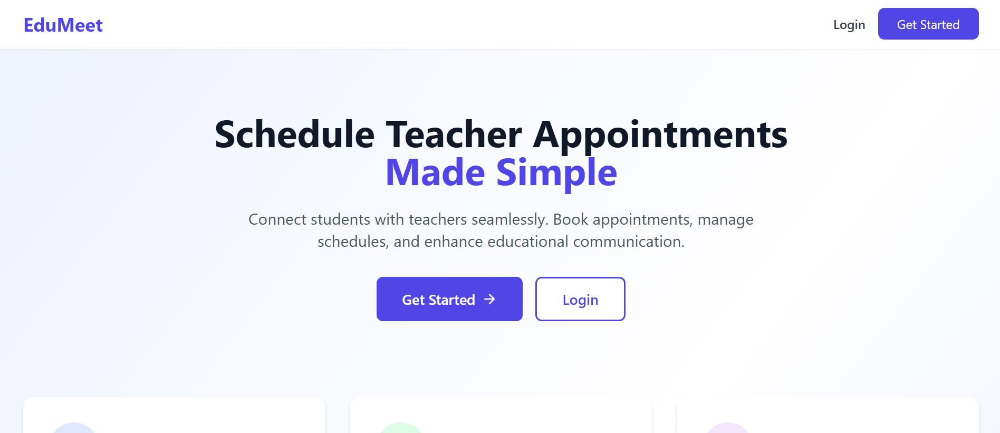
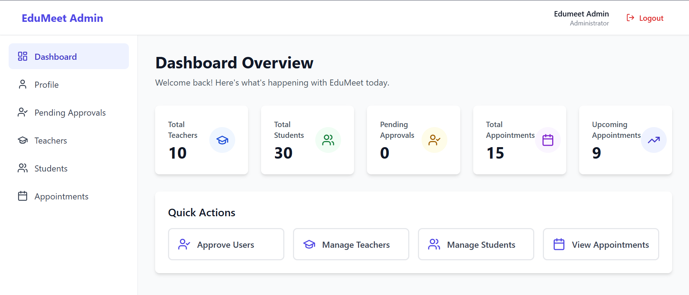
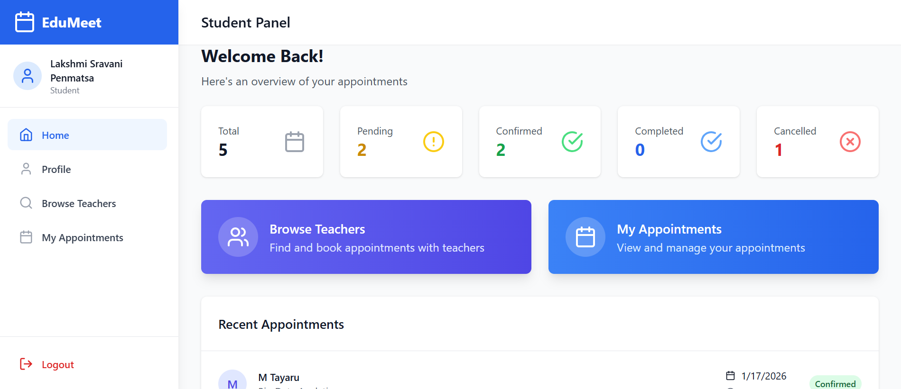
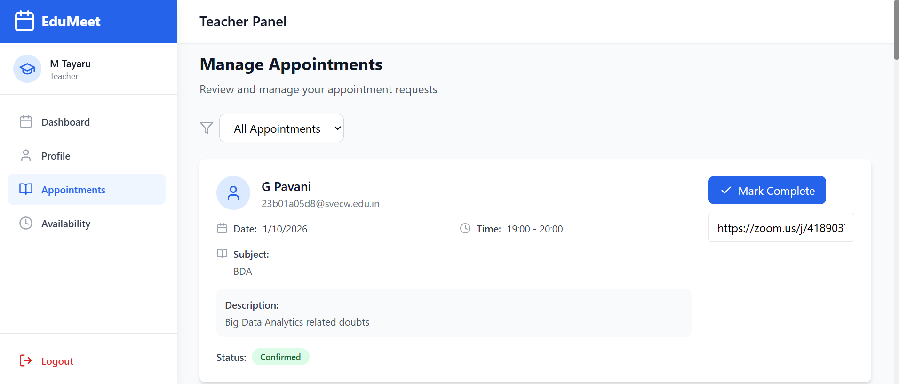
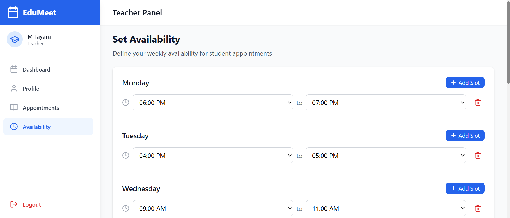

# 🎓 EduMeet — Smart Appointment Scheduler

> **Bridging the gap between students and teachers through structured, conflict-free academic scheduling.**

EduMeet is a **full-stack MERN web application** that streamlines academic interactions by enabling students to book appointments with teachers based on real-time availability — replacing informal communication with a secure, transparent, and efficient scheduling platform.


---

## 📌 Table of Contents

- [Key Features](#-key-features)
- [Core Functionalities](#-core-functionalities)
- [Tech Stack](#️-tech-stack)
- [Project Structure](#-project-structure)
- [Environment Variables](#️-environment-variables)
- [How to Run Locally](#️-how-to-run-locally)
- [Security Features](#-security-features)
- [Future Enhancements](#-future-enhancements)
- [Team Members](#-team-members)

---

## 🚀 Key Features

### 👨‍🎓 Student
| Feature | Description |
|--------|-------------|
| 🔐 Secure Auth | JWT-based authentication with role-based access |
| 📅 Book Appointments | Browse teachers and book based on real-time availability |
| 🚫 Conflict-Free | No duplicate slot bookings via backend validation |
| 📧 Email Alerts | Automated notifications for booking & status updates |
| ⭐ Ratings | Submit feedback within a **48-hour window** post-appointment |
| 🎯 Recommendations | Personalized teacher suggestions based on booking history |

### 👩‍🏫 Teacher
| Feature | Description |
|--------|-------------|
| 🔑 Secure Login | Protected dashboard access |
| 🕐 Manage Slots | Define and update availability slots |
| ✅ Appointment Control | Accept or reject incoming booking requests |
| 📋 View Schedule | See all confirmed upcoming appointments |

### 🛠️ Admin
| Feature | Description |
|--------|-------------|
| ✔️ User Approvals | Approve or reject student/teacher registrations |
| 👥 User Management | Manage all students and teachers |
| 📊 Central Monitoring | Oversee all appointments from a single dashboard |

---

## 🧠 Core Functionalities

- 🔒 **Role-Based Access Control (RBAC)** — Admin, Teacher, Student
- 📆 **Availability-Based Scheduling** — Structured and real-time
- 🚫 **Conflict-Free Booking** — Backend-validated slot protection
- 📧 **Automated Email Notifications** — Booking confirmations & updates
- ⭐ **48-Hour Rating System** — Enforced strictly at the backend
- 🎯 **Personalized Recommendations** — Based on booking history & recency logic

---

## 🛠️ Tech Stack

### 🖥️ Frontend


### ⚙️ Backend


### 📦 Other Tools


---
## 📸 Screenshots

### 🏠 Home Page


---

### 🛠️ Admin Dashboard


---

### 👨‍🎓 Student Dashboard


---

### 📅 Teacher — Manage Appointments


---

### 👩‍🏫 Teacher — Set Availability


---

## 📂 Project Structure

```
📁 EDUMEET/
├── 📁 backend/
│   ├── 📁 config/
│   ├── 📁 controllers/
│   ├── 📁 middleware/
│   ├── 📁 models/
│   ├── 📁 node_modules/
│   ├── 📁 public/
│   ├── 📁 routes/
│   ├── 📁 utils/
│   ├── ⚙️ .env
│   ├── 📄 .gitignore
│   ├── 📄 package-lock.json
│   ├── 📄 package.json
│   └── 📄 server.js
└── 📁 frontend/
    ├── 📁 node_modules/
    ├── 📁 src/
    ├── 📄 index.html
    ├── 📄 package-lock.json
    ├── 📄 package.json
    ├── 📄 postcss.config.js
    ├── 📄 tailwind.config.js
    └── ⚡ vite.config.js
```

---

## ⚙️ Environment Variables

Create a `.env` file inside the `backend/` folder and add the following:

```env
PORT=5000
MONGO_URI=your_mongodb_connection_string
JWT_SECRET=your_jwt_secret
EMAIL_USER=your_email@example.com
EMAIL_PASS=your_app_password
FRONTEND_URL=http://localhost:5173
```

> ⚠️ **Never commit your `.env` file to GitHub.** Make sure it's listed in `.gitignore`.

---

## ▶️ How to Run Locally

### 1️⃣ Clone the Repository

```bash
git clone https://github.com/your-username/edumeet-smart-scheduler.git
cd edumeet-smart-scheduler
```

### 2️⃣ Backend Setup

```bash
cd backend
npm install
npm run dev
```

### 3️⃣ Frontend Setup

```bash
cd frontend
npm install
npm run dev
```

> 🌐 The app will be running at `http://localhost:5173` (frontend) and `http://localhost:5000` (backend).

---

## 🔐 Security Features

- ✅ JWT-based stateless authentication
- ✅ Role-based authorization (RBAC)
- ✅ Password hashing using **bcrypt**
- ✅ Protected API routes with middleware
- ✅ Backend validation for all critical operations
- ✅ `.env` kept out of version control

---

## 📌 Future Enhancements

- [ ] 🔔 Real-time notifications using **WebSockets**
- [ ] 📊 Admin analytics dashboard (top-rated teachers, booking trends)
- [ ] 📅 **Google Calendar** integration
- [ ] 📱 Mobile application support
- [ ] 🤖 Advanced AI-powered recommendation system

---

## 👩‍💻 Team Members

This project was developed as a team collaboration:

| Name | Role |
|------|------|
| **P. Lakshmi Sravani** | Full Stack — Backend Logic & Database Management |
| **Divya Reddy** | Full Stack — API Development, Backend & Validation |
| **P. Ruthu Kumari** | Full Stack — Frontend Components, UI Design & API Integration |
| **S. Parveen Bhanu** | Full Stack — Testing, Debugging, Documentation & UI Enhancements |

---

<div align="center">

⭐ **If you found this project helpful, please give it a star!** ⭐

Made with ❤️ by Team EduMeet

</div>
